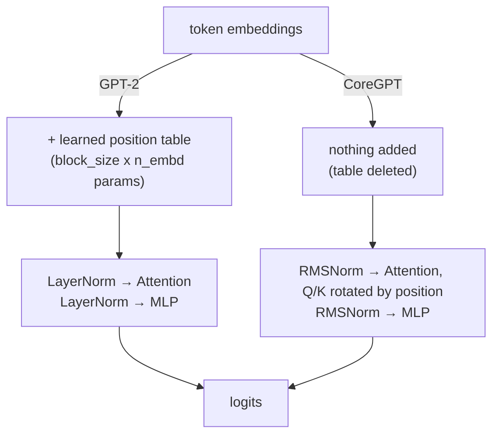
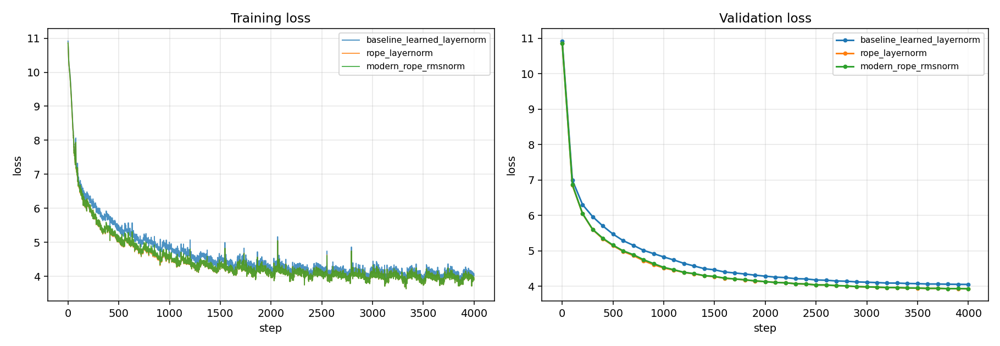

# CoreGPT

GPT-2 with three Llama-era changes, each measured in isolation.

| | Val loss | PPL | vs baseline |
| :--- | ---: | ---: | ---: |
| GPT-2 baseline | 4.0489 | 57.33 | — |
| **+ RoPE** | **3.9251** | **50.66** | **−11.6%** |
| + RoPE + RMSNorm | 3.9277 | 50.79 | −11.4% |

RoPE buys the accuracy. RMSNorm buys back the speed RoPE costs. A KV cache does nothing on
a GPU at this size and is worth 11–38× on CPU.

---

## What changed



| Change | What it replaces | Retrain? |
| :--- | :--- | :---: |
| **RoPE** | Learned position embeddings → rotate Q/K by position, every layer | yes |
| **RMSNorm** | LayerNorm → drop mean-centering and the bias | yes |
| **KV cache** | Recomputing the prefix each step → store K/V, decode one token | no |

Architecture is selected by flags, so one file produces every row:

```bash
python train_modern_gpt.py --pos=learned --norm=layernorm   # baseline
python train_modern_gpt.py --pos=rope    --norm=layernorm   # + RoPE
python train_modern_gpt.py --pos=rope    --norm=rmsnorm     # + RMSNorm
```

---

## Results

30M params (6L / 6H / 384d / 512 ctx), 4000 steps × 131,072 tokens = **524M tokens** of
FineWeb-Edu each. Identical seed, data order and LR schedule; only `--pos` and `--norm`
differ. Trained on a Kaggle T4.



| Model | Position | Norm | Params | Val loss | PPL | Train tok/s |
| :--- | :--- | :--- | ---: | ---: | ---: | ---: |
| baseline | learned | LayerNorm | 30,160,896 | 4.0489 | 57.33 | 54,830 |
| + RoPE | rope | LayerNorm | 29,964,288 | **3.9251** | **50.66** | 40,425 |
| modern | rope | RMSNorm | 29,959,296 | 3.9277 | 50.79 | 45,259 |

### KV cache

Both paths project only the last position through `lm_head` — see finding 4.

| GPU (RTX 3050), 160 tokens | Speedup | | CPU (2 threads), batch 1 | Speedup |
| :--- | ---: | :--- | :--- | ---: |
| batch 1 | 1.18× | | 20-token prompt | **11.0×** |
| batch 4 | 0.88× | | 73-token prompt | **24.3×** |
| batch 16 | 1.00× | | 190-token prompt | **38.5×** |
| batch 32 | 1.08× | | | |

### Correctness

```bash
python benchmark.py --mode=check
```

| Property | Result |
| :--- | :--- |
| Baseline is bit-identical to `train_gpt2.py` | weight diff **0.0e+00**, logit diff **0.0e+00** |
| RoPE scores depend only on relative offset | spread **1.9e-06** across positions 3/10/50 |
| KV cache changes speed and nothing else | **5.7e-06 – 1.4e-05** logit diff on trained weights |

The parity check is what makes the rest meaningful: submodules are built in the same order
as the original, so under one seed `--pos=learned --norm=layernorm` produces bit-identical
weights. Every gap above is architecture, not RNG.

---

## Findings

**1. RoPE does all of the quality work.** −0.124 nats, 11.6% lower perplexity, while
*removing* 196,608 parameters. Adding RMSNorm moves val loss by +0.0026 — noise.

**2. That is the right outcome for RMSNorm.** It was never a quality proposal. Quality
flat, **throughput +12%** (40.4K → 45.3K tok/s), 4,992 fewer parameters, one less reduction
pass per norm. The reason to adopt it is that it is free.

**3. The KV cache only helps if you are compute-bound.** Roughly 1.0× on the GPU, 11–38× on
CPU. Decoding one token of a 30M model leaves a GPU almost idle, so the uncached path's
extra work costs nothing in wall-clock. A CPU has no such slack. "Add a KV cache, get
faster generation" is repeated everywhere without this condition attached.

**4. Small models are vocab-dominated, and it corrupted a measurement.** With `n_embd=384`
against a 50,304 vocab, `lm_head` is ~65% of FLOPs. Generation was projecting *every*
prefill position and discarding all but the last: **63.9 ms vs 6.2 ms**. Fixing it cut
prefill 3.2× — and revealed that an earlier "5.15× KV cache speedup" was mostly this waste,
since the uncached path paid it on every token. Profile the baseline before crediting the
optimization.

**5. `torch.cuda.is_bf16_supported()` lies on Turing.** It defaults to
`including_emulation=True`, so a T4 returns `True` despite having no bf16 tensor cores.
Selecting bf16 on that basis put every matmul on a non-tensor-core path: **~9K tok/s vs
~31K after switching to fp16**. `pick_amp_dtype()` checks compute capability instead.

---

## Run it

**Demo** — Streamlit app comparing all three models side by side on one prompt, with a live
KV-cache benchmark.

```bash
pip install streamlit && streamlit run app.py
```

**Reproduce**

```bash
python fineweb.py --shards 9          # ~900M tokens of FineWeb-Edu
python benchmark.py --mode=check      # correctness
python benchmark.py --mode=inference  # KV cache tables
python benchmark.py --mode=export     # 1.08GB checkpoints -> 180MB bf16 weights
```

Training runs via [`kaggle_train.ipynb`](kaggle_train.ipynb) or the three flag combinations
above. Checkpoints land in `log/<run>/` and resume with `--resume`.

**Deploy** — `Dockerfile` builds a CPU-only image. All three models occupy 808MB of RAM and
generate at ~90 tok/s on 2 cores.

## Files

```
train_gpt2.py          original GPT-2, unmodified (the control)
train_modern_gpt.py    flag-gated model + training loop
benchmark.py           inference / training / correctness / export
app.py                 Streamlit demo
kaggle_train.ipynb     runs all three ablations
```

## Credit

`train_gpt2.py` is Andrej Karpathy's
[build-nanogpt](https://github.com/karpathy/build-nanogpt), kept unmodified as the control.

MIT
